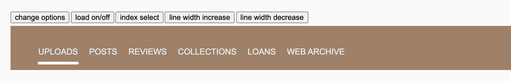

[](https://travis-ci.com/internetarchive/iaux-your-webcomponent) [](https://codecov.io/gh/internetarchive/iaux-your-webcomponent)

# \<underlined-tab-bar>



## Installation

```bash
yarn add @internetarchive/underlined-tab-bar
```
## Basic Usage

```js
<script>
import '@internetarchive/underlined-tab-bar';
</script>

<ia-underlined-tab-bar
        onitemclicked="itemClicked()"
        entries="[
          { displayName: 'UPLOADS' },
          { displayName: 'POSTS' },
          { displayName: 'REVIEWS' },
          { displayName: 'COLLECTIONS' },
          { displayName: 'LOANS' },
          { displayName: 'WEB ARCHIVE' },
        ]"
      >
      </ia-underlined-tab-bar>
<script>      
function itemClicked(e) {
    console.log(e.detail.index);
  }
</script>
  
```

## Advanced Usage
```js
// turn on loading state
const tabBar = document.querySelector('underlined-tab-bar');
tabBar.isLoading = true;

// resize underline
  tabBar.widthMultiplier=0.8;

// select an index
  tabBar.selectedIndex = 3;

```

see unit tests in example app for more usage examples

### CSS Variables
```css
<style>
//underline thickness
  ia-underlined-tab-bar {
      --underLineThick: 5px;
    }
</style>
```

## Local Demo with `web-dev-server`
```bash
yarn start
```
To run a local development server that serves the basic demo located in `demo/index.html`

## Testing with Web Test Runner
To run the suite of Web Test Runner tests, run
```bash
yarn run test
```

To run the tests in watch mode (for &lt;abbr title=&#34;test driven development&#34;&gt;TDD&lt;/abbr&gt;, for example), run

```bash
yarn run test:watch
```

## Linting with ESLint, Prettier, and Types
To scan the project for linting errors, run
```bash
yarn run lint
```

You can lint with ESLint and Prettier individually as well
```bash
yarn run lint:eslint
```
```bash
yarn run lint:prettier
```

To automatically fix many linting errors, run
```bash
yarn run format
```

You can format using ESLint and Prettier individually as well
```bash
yarn run format:eslint
```
```bash
yarn run format:prettier
```

## Tooling configs

For most of the tools, the configuration is in the `package.json` to reduce the amount of files in your project.

If you customize the configuration a lot, you can consider moving them to individual files.
